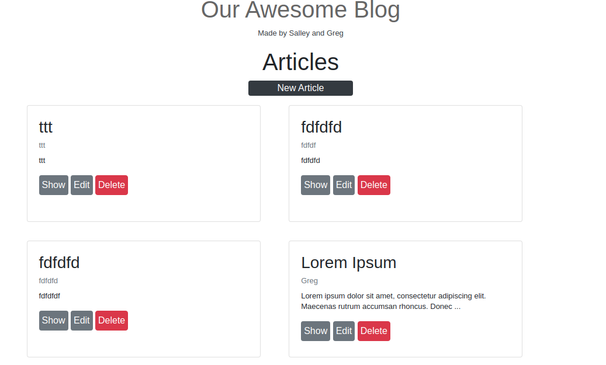

# Rails Blog app

This is a Rails blog app, it's a sample of a simple blog app made using Rails.

I corrected the errors using Rubocop and used Linters to make sure everything was perfect.

## Screenshot

## Built With

- Ruby
- Rails
- Rubocop
- Linters

## Getting Started

To get started with the project follow the steps below:
- `git clone git@github.com:greg0109/railsblogapp.git`
- `cd railsblogapp`
- `git checkout railsblogapp`
- `bundle install`
- `bin/rails db:migrate`

## Authors

👤 Gregorio Rábago Sainz

- GitHub: [@Greg0109](https://github.com/greg0109)
- Twitter: [@Greg_0109](https://twitter.com/greg_0109)

## 🤝 Contributing

Contributions, issues, and feature requests are welcome!

Feel free to check the [issues page](https://github.com/greg0109/RailsBlogApp/issues).

## Show your support

Give a ⭐️ if you like this project!

## 📝 License

This project is [MIT](LICENSE) licensed.
